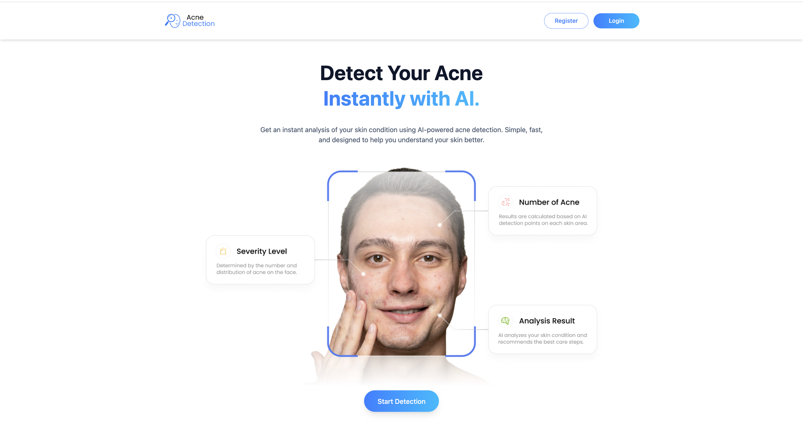
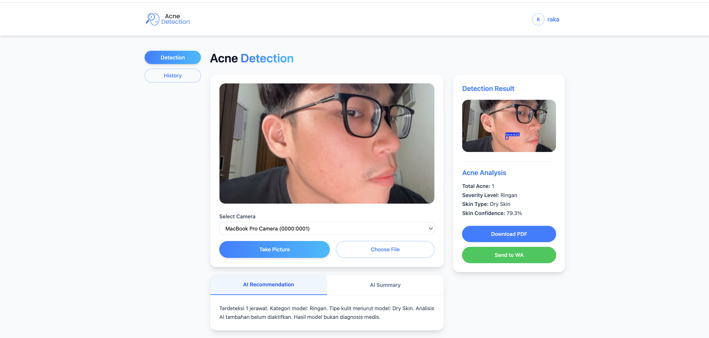
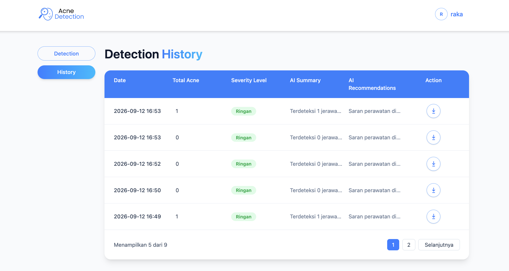

# Acne Detection with YOLOv8

Aplikasi deteksi jerawat dan jenis kulit dengan React/Vite, Flask, YOLOv8, dan MySQL. Mendukung akun pengguna, riwayat deteksi, laporan PDF, dan integrasi Gemini/Fonnte.

## Menjalankan backend

Gunakan Python 3.10+ dan MySQL. Buat database `acne_detection`, lalu:

```sh
cd backend
python3 -m venv .venv
source .venv/bin/activate
pip install -r requirements.txt
cp .env.example .env
```

Isi `SECRET_KEY` dengan nilai acak (misalnya dari `python3 -c "import secrets; print(secrets.token_hex(32))"`), kredensial database, dan `GEMINI_API_KEY`. Isi `FONNTE_API_KEY` jika menggunakan integrasi WhatsApp.

```sh
python app.py
```

Backend berjalan di `http://localhost:5000`. Model inferensi tersedia di `backend/model/`. Lihat implementasi `/generate` untuk pembuatan tabel jika database masih kosong.

## Menjalankan frontend

```sh
cd frontend
npm ci
npm run dev
```

Buka `http://localhost:5173`. Untuk build: `npm run build`.

## Isi repositori

- `frontend/`: antarmuka React.
- `backend/`: API, model inferensi, dan notebook training.
- `backend/.env.example`: contoh konfigurasi tanpa kredensial.

Foto/laporan hasil prediksi, dump database lokal, cache, dan checkpoint terakhir training tidak disertakan dalam Git. Output notebook dibersihkan sebelum upload.

## Screenshot

### Halaman utama



### Deteksi menggunakan kamera MacBook



### Riwayat deteksi


